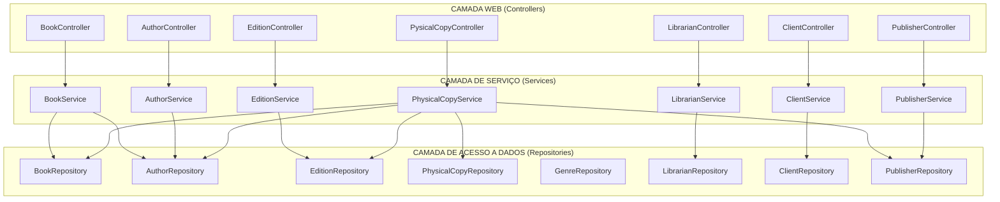
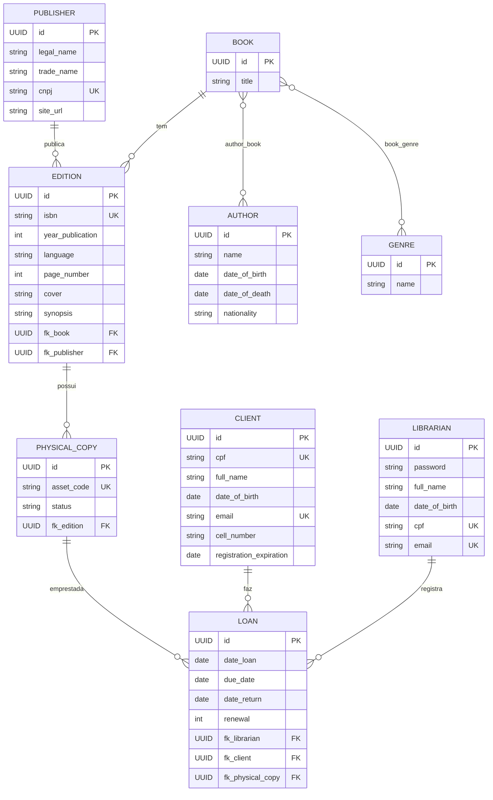
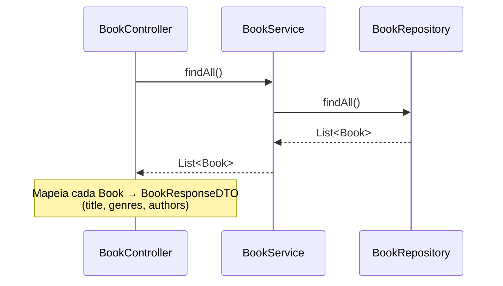
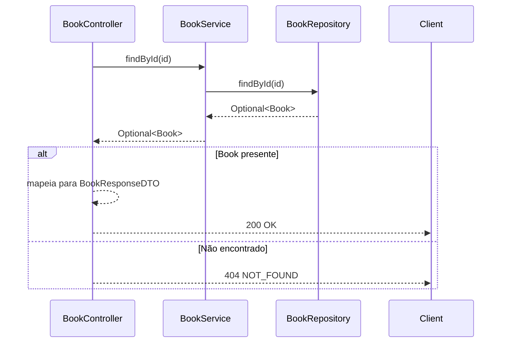
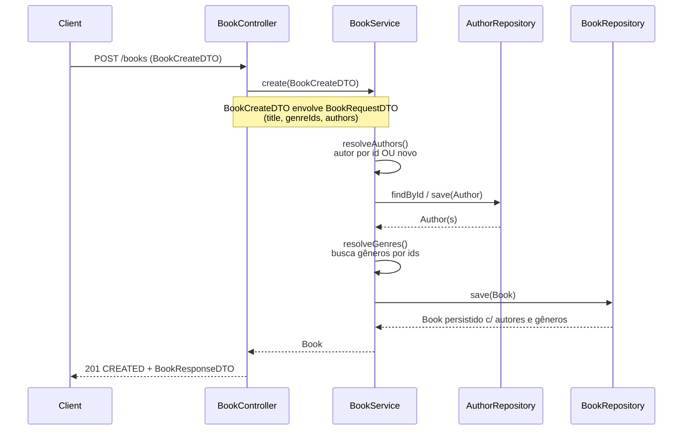
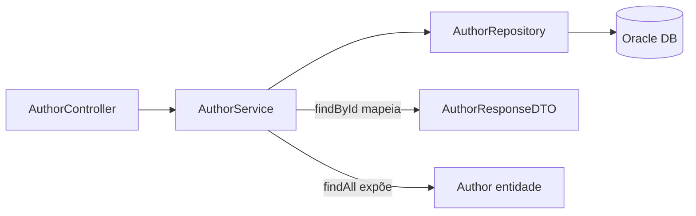
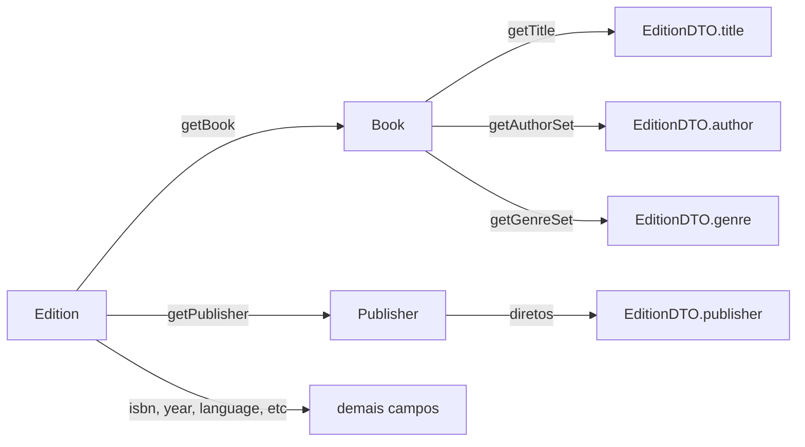
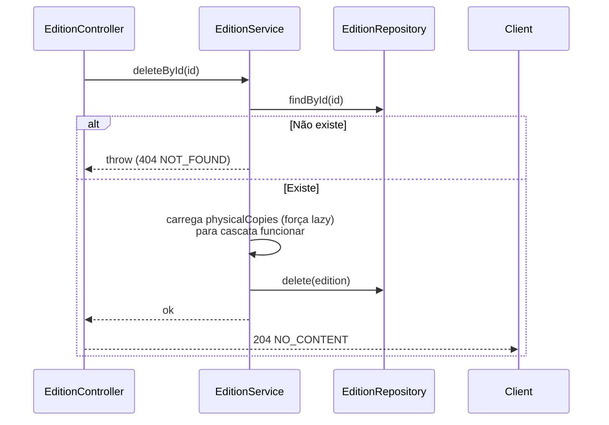
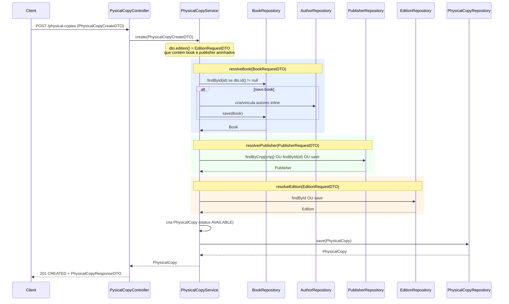

# 🏗️ Arquitetura — API Biblioneteca

> **Stack:** Java 21 · Spring Boot 4 · Spring Data JPA · Oracle DB · Flyway · Lombok · OpenAPI (Swagger)

Este documento descreve **como a aplicação está funcionando atualmente**, separado por endpoints, mostrando como **Controller, Service, DTO, Entidade e Repository** se relacionam.

---

## 📌 Índice
1. [Visão geral da arquitetura em camadas](#-visão-geral-da-arquitetura-em-camadas)
2. [Modelo de Dados (Entidades)](#-modelo-de-dados-entidades)
3. [Mapeamento de endpoints](#-mapeamento-de-endpoints)
4. [Detalhamento por endpoint](#-detalhamento-por-endpoint)
   - [Book](#-book)
   - [Author](#-author)
   - [Edition](#-edition)
   - [Physical Copy](#-physical-copy)
   - [Publisher](#-publisher)
   - [Client](#-client)
   - [Librarian](#-librarian)
5. [Fluxo do cadastro aninhado (Ex.: Physical Copy)](#-fluxo-do-cadastro-aninhado)

---

## 🧭 Visão geral da arquitetura em camadas



**Regra geral:** `Controller` (recebe requisição) → `Service` (lógica de negócio) → `Repository` (persistência) → `DB`.

---

## 🗃️ Modelo de Dados (Entidades)



> **Relacionamentos N-M:** `BOOK ⇄ AUTHOR` (via `author_book`), `BOOK ⇄ GENRE` (via `book_genre`). São gerenciados pela entidade `Book` (owner da relação).

---

## 🗺️ Mapeamento de endpoints

| HTTP | Path | Controller | Service | Resposta |
|------|------|-----------|---------|----------|
| `GET` | `/books` | BookController | BookService | `List<BookResponseDTO>` |
| `GET` | `/books/{id}` | BookController | BookService | `BookResponseDTO` ou 404 |
| `POST` | `/books` | BookController | BookService | `BookResponseDTO` (201) |
| `GET` | `/authors` | AuthorController | AuthorService | `List<Author>` |
| `GET` | `/authors/{id}` | AuthorController | AuthorService | `AuthorResponseDTO` ou 404 |
| `GET` | `/editions` | EditionController | EditionService | `List<EditionDTO>` |
| `DELETE` | `/editions/{id}` | EditionController | EditionService | 204 / 404 |
| `POST` | `/physical-copies` | PysicalCopyController | PhysicalCopyService | `PhysicalCopyResponseDTO` (201) |
| `GET` | `/clients` | ClientController | ClientService | `List<Client>` |
| `GET` | `/librarians` | LibrarianController | LibrarianService | `List<Librarian>`, `List<Person>` |
| `GET` | `/publishers` | PublisherController | PublisherService | `List<Publisher>` |

---

## 🔎 Detalhamento por endpoint

### 📖 Book

#### `GET /books` — Listar todos os livros



**DTOs envolvidos:**
- `BookResponseDTO(String title, List<Genre> genres, List<Author> authors)` — resposta

---

#### `GET /books/{id}` — Buscar livro por ID



---

#### `POST /books` — Criar livro



**DTOs envolvidos:**
- `BookCreateDTO(BookRequestDTO book)` — entrada (wrapper)
- `BookRequestDTO(UUID id, String title, Set<UUID> genreIds, Set<AuthorRequestDTO> authors)` — entrada
- `AuthorRequestDTO(UUID id, name, dateOfBirth, dateOfDeath, nationality)` — entrada
- `BookResponseDTO(title, genres, authors)` — resposta

---

### 👤 Author

#### `GET /authors` — Listar autores
- `AuthorController.findAll()` → `service.findAll()` → `AuthorRepository.findAll()` → **retorna `List<Author>`** (≈ entidade exposta).

#### `GET /authors/{id}` — Buscar autor por ID
- `AuthorController.findById()` → `service.findById()` → `AuthorRepository.findById()` → ```Optional<Author>``` → mapeia para `AuthorResponseDTO` ou 404.

**DTO de resposta:** `AuthorResponseDTO(name, dateOfBirth, dateOfDeath, nationality)`



---

### 📚 Edition

#### `GET /editions` — Listar edições (completa — "o livro definitivo")
- `EditionController.findAll()` → `service.findAll()` → `EditionRepository.findAll()` → mapeia cada `Edition` para `EditionDTO`.

**DTO de resposta:** `EditionDTO(title, author, publisher, isbn, edition_number, year_publication, language, genre, page_number, cover, synopsis)`

> O `EditionDTO` **agrega** dados do `Book` (title, author, genre) + `Publisher` + dados da `Edition`. Por isso é o "objeto completo" visto pelo usuário.



---

#### `DELETE /editions/{id}` — Deletar edição



> ⚠️ **Regra específica:** se a edição possuir `PhysicalCopy`, o JPA precisa carregar a coleção LAZY (`getPhysicalCopies().size()`) para que o `orphanRemoval` delete as cópias antes de remover a edição.

---

### 📦 Physical Copy

#### `POST /physical-copies` — Criar cópia física (cadastro aninhado)

Este é o endpoint mais complexo: recebe um **DTO aninhado** e faz resolução/criação de **Book, Publisher e Edition** automaticamente.



**DTOs envolvidos (entrada aninhada):**
- `PhysicalCopyCreateDTO(EditionRequestDTO edition)`
- `EditionRequestDTO(id, isbn, editionNumber, publicationYear, language, pageNumber, urlCover, synopsis, PublisherRequestDTO publisher, BookRequestDTO book)`
- `PublisherRequestDTO(id, legalName, tradeName, cnpj, siteUrl)`
- `BookRequestDTO(id, title, genreIds, authors)`

**DTO de resposta:**
- `PhysicalCopyResponseDTO(UUID id, String assetCode, String status)`

> **Nota:** o `assetCode` é gerado no `@PrePersist` da entidade `PhysicalCopy`, derivado dos primeiros gêneros do livro + parte do `id`.

---

### 🏢 Publisher

#### `GET /publishers` — Listar editoras
- `PublisherController.findAll()` → `PublisherService.findAll()` → `PublisherRepository.findAll()` → retorna `List<Publisher>`.

O `PublisherRepository` também possui `findByCnpj(String cnpj)` usado internamente pelo `PhysicalCopyService` para evitar CNPJ duplicado.

---

### 👥 Client

#### `GET /clients` — Listar clientes
- `ClientController.findAll()` → `ClientService.findAll()` → `ClientRepository.findAll()` → retorna `List<Client>`.

> ⚠️ **Pendência:** CRUD incompleto — apenas leitura. As **RN03** (unicidade CPF/e-mail) e **RN04** (validade de 3 meses) ainda não têm endpoints de criação/validação no controller.

---

### 🔑 Librarian

#### `GET /librarians` — Listar bibliotecários
- `LibrarianController.findAll()` → `LibrarianService.findAll()` → `LibrarianRepository.findAll()` → retorna `List<Librarian>` e também `List<Person>`.

> ⚠️ `Librarian` estende `Person`. A listagem atual expõe os dois tipos.

---

## 🧩 Fluxo do cadastro aninhado (resumo)

O padrão usado em `POST /physical-copies` demonstra uma **composição de DTOs aninhados**, onde um único payload de entrada aciona a criação em cascata de várias entidades:

```mermaid
graph TD
    PC[PhysicalCopyCreateDTO] --> ER[EditionRequestDTO]
    ER --> P[PublisherRequestDTO]
    ER --> B[BookRequestDTO]
    B --> AU[AuthorRequestDTO x N]
    B --> G[genreIds x N]

    P --> Ent1[Publisher entity]
    B --> Ent2[Book entity]
    AU --> Ent3[Author entity]
    G --> Ent4[Genre entity]
    ER --> Ent5[Edition entity]
    Ent5 --> Ent6[PhysicalCopy entity (status AVAILABLE)]
```

---

## 📁 Estrutura dos pacotes

```
com.jcarlos67.biblioneteca
├── controller/      → endpoints (Book, Author, Edition, PysicalCopy, Publisher, Client, Librarian)
├── service/         → lógica de negócio
├── repository/      → interfaces Spring Data JPA
├── model/
│   ├── collection/  → Book, Edition, Author, Genre, Publisher, PhysicalCopy (+ enums)
│   └── loans/       → Client, Librarian, Person, Loan
├── dto/
│   ├── create/      → BookCreateDTO, PhysicalCopyCreateDTO
│   ├── request/     → BookRequestDTO, AuthorRequestDTO, EditionRequestDTO, PublisherRequestDTO
│   └── response/    → BookResponseDTO, AuthorResponseDTO, PhysicalCopyResponseDTO
├── config/          → SecurityConfig, DevConfig, OpenApiConfig
└── BiblionetecaApplication   → entry point
```

---

## 🚧 Estado atual & pendências

| Módulo | Endpoints CRUD completos? | Observações |
|--------|:---:|-------------|
| Book | Parcial | GET listar/id, POST feito |
| Author | Parcial | GET listar/id |
| Edition | Parcial | GET listar, DELETE |
| PhysicalCopy | Parcial | Somente POST (criação) |
| Publisher | Parcial | Somente GET listar |
| Client | Incompleto | Somente GET listar; sem RN03/RN04 |
| Librarian | Incompleto | Somente GET listar; sem auth |
| Loan | **Ausente** | Entidade existe, mas sem controller/repository/endpoints |
| Genre | **Ausente** | Repository existe, mas sem service/controller |

---

*Documento gerado a partir da análise do código-fonte atual do backend.*
