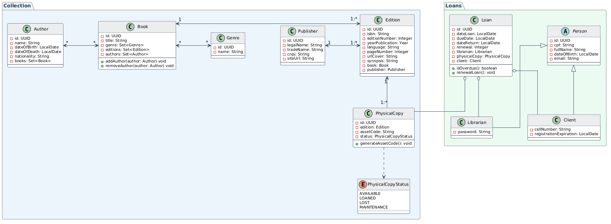
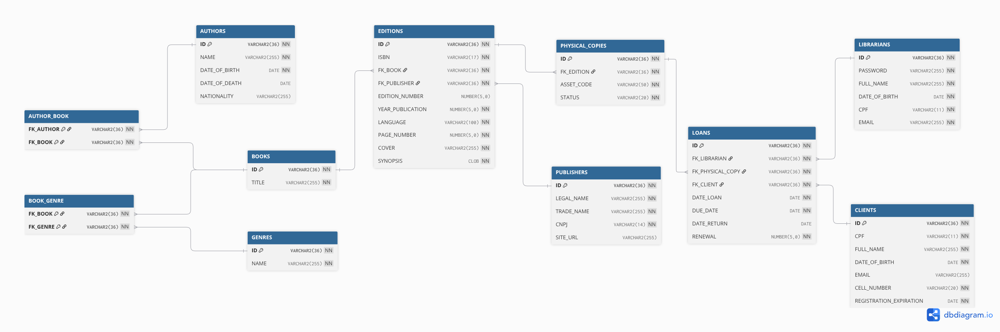

# 📦 API-BIBLIONETECA

> API para gerenciamento do acervo físico, controle de leitores (carteirinha virtual) e ciclo de empréstimos.
> 
---
## ⚖️ REGRAS DE NEGÓCIO
- **RN01 - Arquitetura do Acervo:** Um "Livro" não pode ser emprestado diretamente. O sistema gerencia a *Obra* (Livro), a *Edição* (ISBN, Editora, Ano) e a *Cópia Física* (o item na prateleira). É a **Cópia Física** que transita no empréstimo.
- **RN02 - Dependência de Cadastro:** Para registrar um novo livro é obrigatório vincular um Autor, uma edição e uma Editora. (Se não existirem, o frontend deve acionar o cadastro *inline*).
- **RN03 - Unicidade do Cliente:** O e-mail e o CPF do cliente devem ser únicos (`unique`). O número de telefone pode ser compartilhado entre cadastros.
- **RN04 - Validade da Carteirinha (`registration_expiration`):** O cadastro do cliente tem validade obrigatória de **3 meses**. Após esse período, emite-se um alerta ao bibliotecário.
- **RN05 - Limite de Empréstimos Simultâneos:** Um cliente pode possuir no máximo **3 cópias físicas** emprestadas ao mesmo tempo.
- **RN06 - Ciclo de Renovação (`renewal`):**
    - Cada livro emprestado pode ser renovado no máximo **4 vezes**. Após isso, esse cliente poderá alugar esse volume daqui a trinta dias.
    - A renovação é individual por livro, estendendo o prazo (`due_date`) em exatamente **7 dias**.
- **RN07 - Penalidade Leve (Bloqueio):** Atrasos na renovação ou devolução bloqueiam imediatamente novos empréstimos para o cliente.
- **RN08 - Penalidade Grave (Suspensão):** Se um livro ultrapassar **14 dias (2 semanas)** de atraso, o cadastro do cliente deve ser suspenso por completo durante doze dias, sendo necessário renovação após período.

## REQUISITOS FUNCIONAIS
**🔐 Módulo de Autenticação & Staff**

- Login de Bibliotecário (Validação via CPF/e-mail e Senha).
- Gerenciamento de dados do próprio bibliotecário (Nome, CPF, Data de Nascimento, E-mail).

**📖 Módulo de Acervo**

- **Autores & Editoras:** CRUD completo.
- **Edições & Estoque:** Cadastro de metadados da edição (Idioma, Páginas, Capa) e geração da quantidade de cópias físicas (Estoque).

**👥 Módulo de Clientes (Leitores)**

- CRUD completo de Clientes (Nome, CPF, Data de Nascimento, E-mail, Telefone).

  **🔄 Módulo de Empréstimos (Transações)**

- Registro de saída vinculando: ID do Bibliotecário + ID do Cliente + ID(s) da Cópia Física.
- Renovação de prazo individual de um livro.
- Registro de devolução.

**📊 Módulo de Relatórios (Dashboards)**

- **Leitores:** Relatório de clientes em dia vs. clientes em atraso.
- **Inventário:** Livros em maior quantidade vs. menor quantidade física.
- **Estatísticas (Top Rankings):**
    - Livros mais buscados/lidos (Top 3).
    - Gêneros mais lidos.
    - Autores mais lidos.
    - Editoras mais frequentes no acervo.

---
## UML

## DER

---
Em desenvolvimento por José Carlos - [LinkedIn](https://linkedin.com/in/josecarlosesteves/)